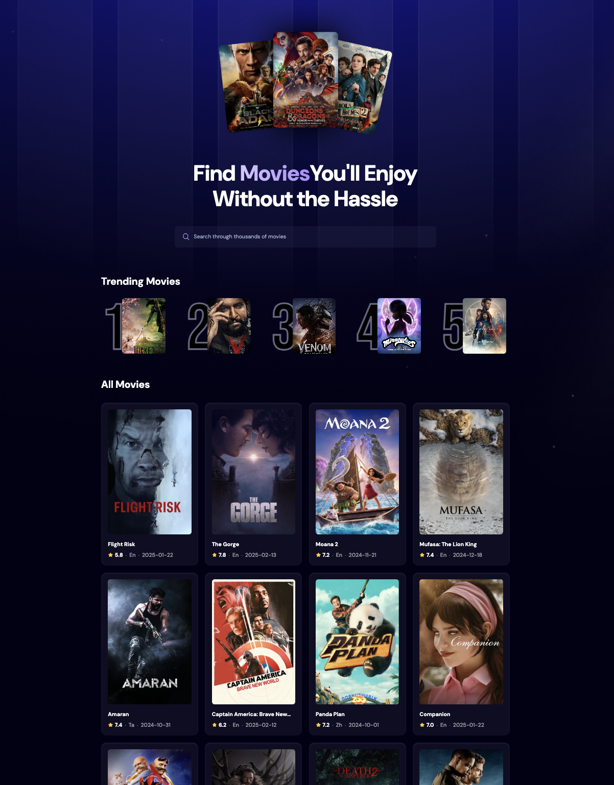
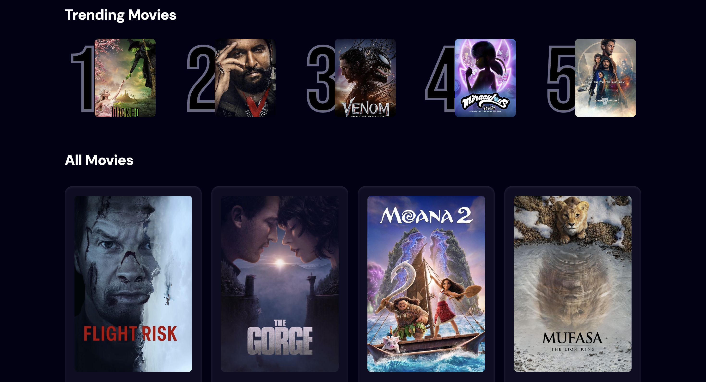

🎬 Movie Search Website

A simple and user-friendly React web application that allows users to search for movies using The Movie Database (TMDb) API. It features a search bar for quick lookups and displays the top 5 trending movies.

🚀 Features

🔎 Search for Movies – Find movies by title using TMDb API.
📈 Trending Movies – Displays the top 5 trending movies.
⏳ Debounced Search – Reduces unnecessary API calls for a better experience.
🎭 Movie Details – Shows key movie details in a clean UI.
⚡ Fast & Responsive – Built with React and optimized for performance.

🛠️ Tech Stack
Frontend: React, Tailwind CSS
API: TMDb API
State Management: React Hooks (useState, useEffect)
Database: Appwrite (for tracking search counts)

📸 Screenshots

 

📜 License
This project is open-source and available under the MIT License.